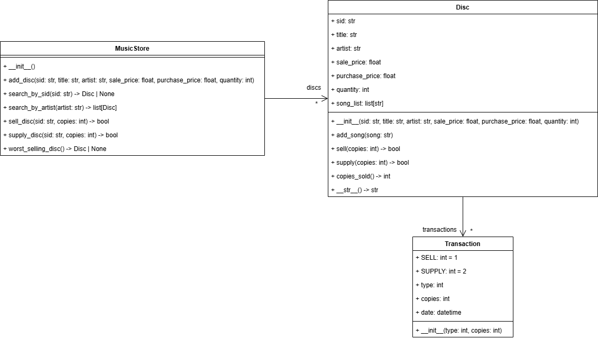

[](README.es.md "Versión en español")

# Music Store

Music store is an application used to asses the knowledge of OOP concepts in python. The application is a simple music store that allows users to add, list and search for music disc. The application is implemented using classes and objects in python.

The model of the application is as follows:



The application code is incomplete, the idea is to complete it taking into account the following steps.

1. Complete de class `Transaction` taking into account the following requirements:
    - The class should have a constant `SELL` of type `int` with value `1`.
    - The class should have a constant `SUPPLY` of type `int` with value `2`.
    - The class should have an `__init__` method that receives the following parameters:
        - `type` of type `int`.
        - `copies` of type `int`.

        In the `__init__` method the class should initialize the attributes `type` and `copies` with the values received as parameters.
    - The class should have an attribute `date` of type `datetime` that should be initialized with the current date and time (you can use the `datetime.now()` function to get the current date an time).

2. Complete the `Disc` class taking into account the following requirements:
    - The class should have an `__init__` method that receives the following parameters:
        - `sid` of type `str`.
        - `title` of type `str`.
        - `artist` of type `str`.
        - `sale_price` of type `float`.
        - `purchase_price` of type `float`.
        - `quantity` of type `int`.

        In the `__init__` method the class should initialize the attributes `sid`, `title`, `artist`, `sale_price`, `purchase_price` and `quantity` with the values received as parameters.
    - The class should have the attributes `transactions` of type `list[Transaction]` and `song_list` of type `list[str]`. Both attributes should be initialized as an empty list.
    - The class should have an instance method `add_song` that receives a parameter `song` of type `str` and adds the song to the `song_list` attribute.
    - The class should have an instance method `sell` that receives a parameter `quantity` of type `int` and does the following:
        - If the parameter `copies` is greater than the `quantity` attribute of the disc, the method should return `False`.
        - Otherwise, the method decreases the `quantity` attribute of the disc by the value of the parameter `copies` and adds a new `Transaction` object to the `transactions` list with the type `Transaction.SELL` and the number of `copies` sold.
        - The method should return `True`.
    - The class should have an instance method `supply` that receives a parameter `copies` of type `int` and does the following:
        - Increases the `quantity` attribute of the disc by the value of the parameter `copies`
        - Adds a new `Transaction` object to the `transactions` list with the type `Transaction.SUPPLY` and the number of `copies` supplied.
    - The class should have an instance method `copies_sold` that returns an `int` with the total number of copies sold. 
        > **Hint:** you could add the number of copies of each transaction of type `Transaction.SELL`.
    - The class should have an instance method `__str__` that return a `str` with the following format:
        ```
        SID: {sid}
        Title: {title}
        Artist: {artist}
        Song List: {song_list}
        ```

        Where `{sid}`, `{title}` and `{artist}` should be replaced with the values of the attributes of the disc. The `{song_list}` should be replaced with the list of songs of the disc separated by a comma and a space.

        > **Hint:** you could use an f-string (`f""`) to format the string and `\n` within the string for a new line.

3. Complete the `MusicStore` class taking into account the following requirements:
    - The class should have an `__init__` method that initializes the `discs` attribute of type `dict[str, Disc]` as an empty dictionary.

    - The class should have an instance method `add_disc` that receives the parameters `sid` of type `str`, `title` of type `str`, `artist` of type `str`, `sale_price` of type `float`, `purchase_price` of type `float` and `quantity` of type `int` and does the following:
        - Checks if the `sid` is not already in the `discs` dictionary.
        - If the `sid` is not in the `discs` dictionary, the method creates a new `Disc` object with the received parameters and adds it to the `discs` dictionary using the `sid` as the key.

    - The class should have an instance method `search_by_sid` that receives the parameter `sid` of type `str` and returns `Disc | None`. The method should return the disc with the `sid` received as parameter or `None` if the disc is not found.

    - The class should have an instance method `search_by_artist` that receives the parameter `artist` of type `str` and returns `list[Disc]`. The method should return a list with all the discs that have the `artist` received as parameter.
    
    - The class should have the instance methods `sell_disc` and `supply_disc` that receive the parameters `sid` of type `str` and `copies` of type `int`. Copy the following code to the `MusicStore` class to complete the methods:
        ```python
        def sell_disc(self, sid: str, copies: int) -> bool:
            disc = self.search_by_sid(sid)
            if disc is None:
                return False
            
            return disc.sell(copies)

        def supply_disc(self, sid: str, copies: int) -> bool:
            disc = self.search_by_sid(sid)
            if disc is None:
                return False
            
            disc.supply(copies)
            return True
        ```
    - The class should have an instance method `worst_selling_disc` that returns `Disc | None` with the disc that has sold the least number of copies or `None` if there are no discs in the store.